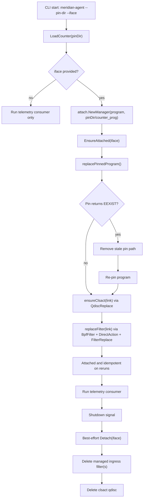

# MER-25 Attach Flow

Notes:

- `EnsureAttached` is idempotent by design (`QdiscReplace` + `FilterReplace`).
- Restart safety is handled by unpin-or-replace when pinning program paths.
- `Detach` is idempotent and treats missing interfaces/resources as success.
